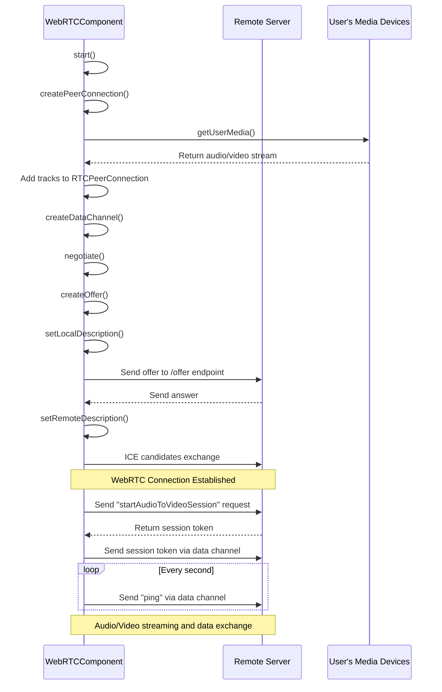

# Simli WebRTC + Retell Frontend Demo (React/Node.js)


https://github.com/simliai/simli-retell-frontend-reactjs-demo/assets/22096869/41916cad-7b8c-42ef-b19c-d594c9d9fdc2




## Run this Demo

Step 1: create .env file in root directory
```
REACT_APP_SIMLI_KEY="YOUR-SIMLI-API-KEY"
REACT_APP_RETELL_KEY="YOUR-RETELL-API-KEY"
```
Step 2: Update agentID and FaceID in `src/App.tsx`
```js
const agentId = "YOUR-RETELL-AGENT-ID";
const faceId = "YOUR-SIMLI-FACE-ID"; 
```

Step 3: `npm install`

Step 4: `npm start`

Step 5: open a new terminal and run `node server.js`
